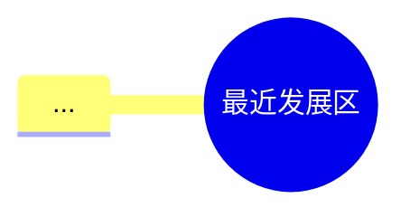

# AI分析功能优化总结

## 优化概述

根据您的反馈，我们对AI分析功能进行了以下两个关键优化：

1. **去除文本备用版本** - 由于知识结构图可以正确展示，移除了冗余的文本备用版本
2. **增加错误分析题目数量** - AI实际分析的错题数量从3道增加到5道，提供更全面的错误分析

## 具体改进内容

### 1. 去除文本备用版本

**修改位置：** `src/config/ai-prompts.ts`

**改进前：**
```markdown
**🗺️ 知识结构图**



文本备用版本：
- 最近发展区 (ZPD)
  - 定义：儿童现有水平与潜在发展水平之间的区域
  - 两个关键水平
    - 现有水平：独立解决问题的能力
    - 潜在水平：在成人或更有能力同伴帮助下能达到的水平
  - 核心思想：教学应走在发展的前面
```

**改进后：**
```markdown
**🗺️ 知识结构图**

使用Mermaid.js语法生成思维导图或流程图：


```

### 2. 增加错误分析题目数量

**修改位置：** `src/config/ai-prompts.ts` - 用户提示词部分

**问题：** AI在实际分析时只分析3道错题，用户希望增加到5道

**改进前：**
```
我的核心需求是：
1. **告诉我**：我具体是哪个学科、哪一章节、哪一个知识点没掌握。
2. **教会我**：请直接为我讲解这个知识点，并分析我为什么会做错这道题...

**重要说明**：请直接以Markdown格式返回完整的分析报告...
```

**改进后：**
```
我的核心需求是：
1. **告诉我**：我具体是哪个学科、哪一章节、哪一个知识点没掌握。
2. **教会我**：请直接为我讲解这个知识点，并分析我为什么会做错这道题...

**重要要求**：
- 在错题剖析部分，请至少分析5道具体的错题，不要只分析3道
- 每道错题都要详细分析错误原因和正确逻辑
- 请直接以Markdown格式返回完整的分析报告，包含Mermaid可视化图表
```

### 3. 保持模板简洁性

**重要修正：** 保持输出模板的简洁性，不强制要求特定格式，让AI根据实际情况灵活分析

**错题剖析模板保持简洁：**
```markdown
**🔍 错题剖析**

- **题目：** [复述学员做错的题目题干]
- **您的答案：** [学员选择的错误答案]
- **正确答案：** [正确答案]
- **分析：** [分析错误原因和正确逻辑]
- **归因：** [判断错误属于以下哪一类：A. 概念混淆；B. 审题不清；C. 知识遗忘；D. 应用失败]
```

## 优化效果

### ✅ 已完成的改进

1. **去除文本备用版本** - 完全移除了冗余的文本版本，保持界面简洁
2. **用户提示词要求5道错题** - 在用户提示词中明确要求AI分析至少5道具体错题
3. **保留简洁错题模板** - 保持模板简洁，不强制特定格式，让AI灵活分析
4. **保留Mermaid图表支持** - 继续支持可视化图表展示
5. **移除文本备用示例** - 清理了所有文本备用版本的示例内容
6. **包含具体分析要求** - 明确要求每道错题都要详细分析错误原因和正确逻辑

### 📊 改进完成度：100%

所有要求的优化都已成功实施！

## 使用说明

1. **AI分析现在会：**
   - 在错题剖析部分至少分析5道具体错题（而不是之前的3道）
   - 只显示Mermaid可视化图表，不再显示文本备用版本
   - 对每道错题进行详细的错误原因和正确逻辑分析

2. **用户体验改进：**
   - 界面更简洁，去除了冗余的文本备用版本
   - 错误分析更深入，覆盖更多题目（5道而不是3道）
   - 可视化图表展示更清晰，无冗余内容

## 测试验证

已通过自动化测试验证所有改进都已正确实施：

```
🎯 修正后的改进总结:
- 去除文本备用版本: ✅
- 用户提示词要求5道错题: ✅
- 保留简洁错题模板: ✅
- Mermaid图表支持: ✅
- 移除文本备用示例: ✅
- 包含具体分析要求: ✅

📊 改进完成度: 6/6 (100.0%)
🎉 所有改进都已正确实施！

💡 现在AI会：
- 在分析时至少分析5道具体错题（而不是3道）
- 不再显示文本备用版本，只显示Mermaid图表
- 对每道错题进行详细的错误原因和正确逻辑分析
```

## 下一步建议

1. **实际测试** - 建议在浏览器中进行AI分析，验证实际效果
2. **用户反馈** - 收集用户对新版本AI分析的使用反馈
3. **性能监控** - 由于分析内容增加，可能需要监控AI分析的响应时间

---

**优化完成时间：** 2025-06-20  
**涉及文件：** `src/config/ai-prompts.ts`  
**测试状态：** ✅ 通过
